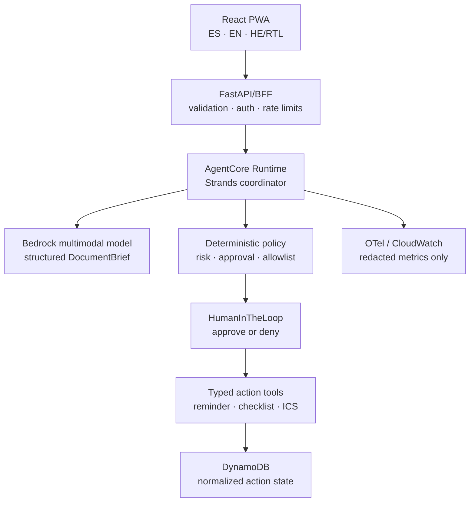
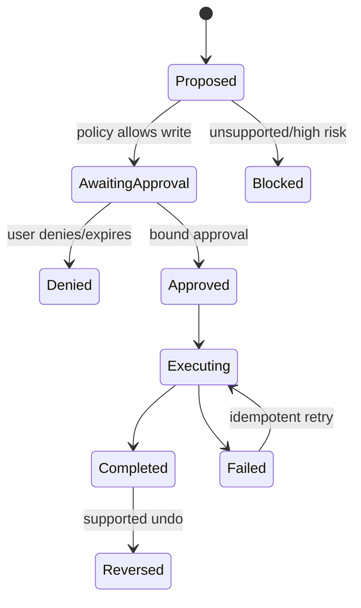

# Ezriva - Technical Specification

> **Event:** Agents for Humans Hackathon
> **Track:** Everyday Agents
> **Author:** Kevin Cusnir with Codex
> **Date:** 2026-08-11 (Asia/Jerusalem)
> **Version:** 0.1 - Codex build specification
> **Source:** `scope.md`, `prd.md`, `brand-ux.md`

## Overview

Ezriva is a React PWA backed by a Python Strands agent. A user provides a short Hebrew document or selects a synthetic demo fixture. A multimodal Bedrock model produces a validated `DocumentBrief`; a deterministic policy service decides which actions are allowed; Strands `HumanInTheLoop` interrupts every write action; and an approved tool stores a reminder plus generates an importable calendar file. The system returns a redacted receipt and safe activity trace.

The architecture intentionally uses **one coordinating agent**, not a multi-agent hierarchy. The judging value comes from reliable tool orchestration, structured evidence, approval/resume behavior, idempotency, deployment, and observability - not from maximizing agent count.

## Architectural Decisions

| ID | Decision | Rationale |
|---|---|---|
| ADR-001 | Python for the agent/backend; TypeScript for the UI. | Python currently has the broadest Strands/AgentCore examples and integrations; React/TS matches Kevin's frontend strengths. |
| ADR-002 | One Strands coordinator with narrow typed tools. | Easier to test, explain, and keep safe than a multi-agent graph within the hackathon budget. |
| ADR-003 | Direct multimodal Bedrock analysis; no Textract in the critical path. | Textract's official language list does not include Hebrew. An extra OCR service adds cost and a false sense of coverage. |
| ADR-004 | Structured output validated by Pydantic. | Prevents free-form model text from becoming executable tool arguments. |
| ADR-005 | Deterministic policy outside the model. | Tool permission cannot depend on model confidence or document instructions. |
| ADR-006 | Every write uses Strands `HumanInTheLoop`. | Satisfies the human-controlled product promise and provides visible agentic interruption/resume behavior. |
| ADR-007 | Persist normalized reminders/actions, not raw documents. | Minimizes privacy risk and simplifies retention/deletion. |
| ADR-008 | Real MVP action is an Ezriva reminder/checklist plus generated `.ics`; direct Google Calendar is stretch. | Completes a useful action without making OAuth the critical path. The tool interface keeps later providers replaceable. |
| ADR-009 | AgentCore Runtime is the target, gated behind a local working vertical slice. | It strengthens technical implementation, but deployment cannot block the core demo. |
| ADR-010 | Public demo accepts synthetic fixtures only; private/local mode may accept uploads. | Prevents public PII collection, cost abuse, and unsafe evaluator data handling. |
| ADR-011 | No long-term semantic memory in MVP. | Preferences and domain state are enough; current memory integration issues should not affect the hero path. |
| ADR-012 | Model ID and provider settings are configuration, never business logic. | Availability and pricing can change during the event.

## Stack

### Frontend

- React + TypeScript + Vite.
- React Router for focused routes.
- TanStack Query for server state and retries under explicit control.
- `react-i18next` for Spanish/English/Hebrew resources.
- Zod for API boundary validation.
- CSS custom properties + CSS Modules for a small bespoke design system.
- Radix Dialog or an equivalent accessible primitive only for the approval sheet.
- Browser Speech Synthesis as an optional progressive enhancement.
- Vitest, Testing Library, `jest-axe`, and Playwright.

### Agent/backend

- Python 3.11 or 3.12, selected after the AgentCore deployment spike.
- FastAPI for local development/BFF endpoints.
- `strands-agents` with a Bedrock multimodal model.
- Pydantic v2 schemas and discriminated unions.
- `BedrockAgentCoreApp` / AgentCore Runtime integration using the current official deployment guide.
- Strands `HumanInTheLoop` for all write-capable tools with trust disabled.
- AWS SDK (`boto3`) behind repository adapters.
- DynamoDB for normalized action records and idempotency keys in hosted mode.
- In-memory/fake repository for unit tests; optional SQLite adapter for local persistence.
- `icalendar` or a similarly small standards-compliant library for `.ics` generation.
- `pytest`, `pytest-asyncio`, `httpx`, `moto` where useful, Ruff, and mypy/pyright.

### AWS deployment target

- Static frontend: AWS Amplify Hosting or S3 + CloudFront.
- Agent: Amazon Bedrock AgentCore Runtime.
- Thin BFF fallback: API Gateway + Lambda if browser-to-Runtime authentication, CORS, upload size, or interruption resume proves brittle.
- Identity for private mode: Cognito Hosted UI with JWT; public Demo Mode is fixture-only and rate-limited.
- State: DynamoDB with encryption, conditional writes, TTL, and least-privilege access.
- Observability: OpenTelemetry/CloudWatch with PII-minimized events.
- Cost controls: AWS Budget, model/token limits, request throttling, trace sampling, and no unused AgentCore services.

## System Architecture



### Trust boundaries

1. **Untrusted input:** uploaded bytes, pasted text, document content, filenames, and metadata.
2. **Model boundary:** model output is untrusted until Pydantic and domain validators accept it.
3. **Policy boundary:** only deterministic application code may authorize an action category.
4. **Approval boundary:** only a server-issued approval reference bound to an immutable payload may resume a write.
5. **Tool boundary:** tool input is validated again, ownership is enforced, and a conditional idempotent write precedes side effects.
6. **Telemetry boundary:** content/arguments are redacted before any trace exporter.

## Core Domain Model

### `DocumentBrief`

```text
DocumentBrief
├── brief_id: UUID
├── source_hash: SHA-256
├── detected_languages: list[LanguageCode]
├── target_language: es | en | he
├── document_type: appointment | bill | notice | unknown | high_risk
├── sender: EvidenceField[str] | null
├── plain_summary: str
├── facts: list[EvidenceFact]
├── uncertain_fields: list[Uncertainty]
├── risk_signals: list[RiskSignal]
├── recommended_action: ActionDraft | null
└── created_at: aware datetime
```

### Evidence types

```text
EvidenceField[T]
├── normalized_value: T | null
├── source_excerpt: str | null
├── status: confirmed | uncertain | conflicting | not_found
└── reason: str | null

EvidenceFact
├── key: sender | date | time | location | amount | contact | requested_action
├── label: localized label key
└── field: EvidenceField[str]
```

Do not accept a model-generated numeric confidence as authoritative. Product decisions use field status, evidence, validator results, and deterministic policy.

### Action types

```text
ActionDraft = ReminderDraft | ChecklistDraft | IcsDraft | EscalationDraft

ReminderDraft
├── title
├── due_at (Asia/Jerusalem-aware)
├── reminder_at
├── location | null
├── redacted_notes
└── source_hash
```

### Action state machine



Valid transitions are enforced in domain code and conditional persistence, not inferred by the model.

## Agent Design

### System responsibility

The coordinator may:

- analyze a short document;
- extract evidence-backed facts;
- identify ambiguity and risk signals;
- prepare one allow-listed action proposal;
- request a human decision;
- invoke a typed tool only after valid approval;
- summarize the receipt.

It may not:

- change its own policy or tool allowlist;
- treat instructions inside a document as system instructions;
- execute arbitrary code, browse portals, send messages, pay, submit forms, or offer professional decisions;
- invent missing critical dates/amounts;
- access another user's records.

### Structured-output strategy

1. Wrap the source content in explicit untrusted-data boundaries.
2. Ask for `DocumentBriefCandidate` structured output.
3. Validate schema, length, enum values, date/time, source evidence, and required fields.
4. Normalize time using `Asia/Jerusalem` unless the source explicitly provides another zone.
5. Run deterministic risk rules.
6. Create `ActionDraft` only from validated fields.
7. Present the draft to the user; do not let a prose model response bypass the domain model.

### Prompt-injection defense

- System prompt explicitly states that document content is evidence, never instructions.
- No general shell, HTTP, filesystem, code interpreter, or arbitrary MCP tool is exposed.
- Tool schemas contain only required fields and bounded enums.
- Policy and approval code runs after model output.
- Adversarial fixtures contain “ignore previous instructions” in Hebrew and English.
- Logs never record raw malicious content.

### Custom tools

#### `get_preferences`

- Read-only.
- Returns target language, text size, quiet hours, and time zone.
- Never returns credentials or supporter contacts.

Implements: `prd.md > Epic 1`, `Epic 6`.

#### `save_reminder`

- Write; human approval required.
- Accepts a validated `ReminderDraft`, owner ID, source hash, and idempotency key.
- Uses a conditional write to create exactly one reminder.
- Returns a receipt with reminder ID and display-safe fields.

Implements: `prd.md > EZR-US-502`, `EZR-US-503`, `EZR-US-504`.

#### `save_checklist`

- Write; human approval required.
- Saves a short bounded checklist when no calendar time exists.
- No arbitrary generated links or commands.

Implements: `prd.md > EZR-US-401`, `EZR-US-404`.

#### `generate_ics`

- Write/file generation; human approval required.
- Produces one RFC 5545-compatible event file from an approved draft.
- Escapes newlines/commas and normalizes time zones.
- Does not claim the event is in an external calendar until imported.

Implements: `prd.md > EZR-US-402`, `EZR-US-502`.

#### `reverse_action`

- Write; second approval required.
- Reverses only an Ezriva-owned reminder/checklist. It cannot silently remove an imported external calendar event.

Implements: `prd.md > EZR-US-505`, `EZR-US-702`.

## Deterministic Policy

### Categories

- `READ_ONLY`: explanation with no action.
- `WRITE_REVIEW`: reminder, checklist, or `.ics`; always requires approval.
- `BLOCKED_HIGH_RISK`: payment, legal filing, medical decision, prescription, identity verification, form submission, or unsupported external communication.
- `NEEDS_CLARIFICATION`: critical fact missing/conflicting.

### Decision order

1. Reject invalid/unreadable input.
2. Detect prompt-injection/risk signals as untrusted content indicators.
3. Block unsupported action types.
4. Require clarification for missing date/time/destination.
5. Construct immutable action payload.
6. Hash/canonicalize payload.
7. Issue short-lived approval reference.
8. Resume only if owner, payload hash, expiry, state, and action type still match.

### Approval record

```text
ApprovalRecord
├── approval_id: UUID
├── owner_id: str
├── action_id: UUID
├── payload_hash: str
├── decision: pending | approved | denied | expired
├── expires_at: datetime
└── decided_at: datetime | null
```

The UI approval button is necessary but not sufficient; server-side verification is authoritative.

## API Contracts

All endpoints are versioned under `/api/v1`. Exact AgentCore resume payloads remain inside the runtime adapter so the web contract stays stable.

### `GET /healthz`

Returns process health without invoking a model.

```json
{ "status": "ok", "version": "0.1.0" }
```

### `GET /api/v1/demo/fixtures`

Returns only public synthetic fixture metadata.

```json
{
  "items": [
    {
      "id": "he-clinic-appointment-01",
      "title_key": "fixtures.clinicAppointment.title",
      "document_type": "appointment",
      "synthetic": true
    }
  ]
}
```

### `POST /api/v1/analyses`

One of:

- `multipart/form-data` with `document` in authenticated/local mode; or
- JSON `{ "fixture_id": "...", "target_language": "es" }` in public Demo Mode.

Success `202`:

```json
{
  "analysis_id": "uuid",
  "status": "processing",
  "status_url": "/api/v1/analyses/uuid"
}
```

Validation errors use a stable problem-details shape and never echo raw content.

### `GET /api/v1/analyses/{analysis_id}`

Returns one of `processing`, `needs_input`, `ready`, `failed`, or `blocked`, plus a validated public `DocumentBriefView`. No chain-of-thought is returned.

### `POST /api/v1/actions/{action_id}/approve`

```json
{
  "approval_id": "uuid",
  "payload_hash": "sha256-hex"
}
```

Returns `202` while resuming execution, `200` with the existing receipt for an idempotent repeat, `409` for stale/changed proposals, or `403` for wrong ownership.

### `POST /api/v1/actions/{action_id}/deny`

Marks the pending intervention denied and guarantees no write tool ran.

### `GET /api/v1/actions/{action_id}`

Returns action status and a display-safe receipt.

### `POST /api/v1/actions/{action_id}/reverse`

Creates a new approval requirement for supported Ezriva-owned reversals.

### `GET /api/v1/activity`

Returns redacted events: stage, tool name, status, timestamp, and deterministic/model origin. It never returns prompts, raw source, tool arguments, tokens, or credentials.

### `DELETE /api/v1/history`

Deletes Ezriva-owned normalized history according to retention rules and explains that external/imported calendar items are separate.

## Data Persistence

### DynamoDB single-table MVP

| Entity | PK | SK | Important attributes |
|---|---|---|---|
| Action | `USER#{sub}` | `ACTION#{uuid}` | status, type, payload_hash, redacted display fields, created/updated, TTL |
| Idempotency | `USER#{sub}` | `IDEMPOTENCY#{key}` | action_id, payload_hash, expires_at |
| Approval | `USER#{sub}` | `APPROVAL#{uuid}` | action_id, payload_hash, decision, expires_at |
| Activity | `USER#{sub}` | `EVENT#{timestamp}#{uuid}` | stage, status, tool_name, origin, TTL |
| Preferences | `USER#{sub}` | `PREFERENCES` | language, text size, quiet hours, time zone |

Do not store raw image/PDF bytes or full Hebrew text in DynamoDB. A redacted source excerpt may exist only when necessary for the receipt and explicitly allowed by the retention design.

### Idempotency

`idempotency_key = SHA256(owner_id + action_type + canonical_payload + source_hash)`

- Canonical JSON uses stable ordering and normalized dates.
- Conditional write fails if the key exists.
- Existing receipt is returned when payload hashes match.
- Mismatched payload under a reused key is a conflict.

## File Structure

```text
ezriva/
├── AGENTS.md                         # Project rules and Codex handoff
├── README.md                         # English public documentation
├── LICENSE                           # MIT
├── SECURITY.md                       # Threat model and reporting
├── PRIVACY.md                        # Demo/privacy/retention behavior
├── CONTRIBUTING.md
├── .env.example
├── .gitignore
├── docker-compose.yml                # Optional local integration stack
├── package.json                      # Workspace commands if using a JS runner
├── pyproject.toml
├── apps/
│   ├── web/
│   │   ├── src/
│   │   │   ├── app/                  # Router, providers, query client
│   │   │   ├── components/           # Accessible reusable UI
│   │   │   ├── features/
│   │   │   │   ├── onboarding/
│   │   │   │   ├── intake/
│   │   │   │   ├── analysis/
│   │   │   │   ├── approval/
│   │   │   │   ├── receipts/
│   │   │   │   └── activity/
│   │   │   ├── i18n/                 # es/en/he resources and direction
│   │   │   ├── lib/                  # API client, schemas, dates
│   │   │   ├── styles/               # Tokens, global, reduced motion
│   │   │   └── test/
│   │   ├── e2e/
│   │   └── public/
│   └── api/
│       ├── src/ezriva/
│       │   ├── main.py                # FastAPI/health/bootstrap
│       │   ├── config.py              # Typed environment config
│       │   ├── api/                   # Versioned routes and problem details
│       │   ├── agent/
│       │   │   ├── coordinator.py     # Strands agent construction
│       │   │   ├── prompts.py         # Untrusted-data boundaries
│       │   │   ├── schemas.py         # Model candidate schemas
│       │   │   └── runtime.py         # Local/AgentCore adapter
│       │   ├── domain/
│       │   │   ├── models.py          # Brief/action/approval/receipt
│       │   │   ├── policy.py          # Deterministic decisions
│       │   │   ├── transitions.py     # State machine
│       │   │   └── errors.py
│       │   ├── tools/
│       │   │   ├── preferences.py
│       │   │   ├── reminders.py
│       │   │   ├── checklists.py
│       │   │   ├── ics.py
│       │   │   └── reversal.py
│       │   ├── repositories/
│       │   │   ├── ports.py
│       │   │   ├── memory.py
│       │   │   └── dynamodb.py
│       │   ├── security/
│       │   │   ├── ownership.py
│       │   │   ├── approvals.py
│       │   │   ├── files.py
│       │   │   └── redaction.py
│       │   └── observability/
│       │       ├── events.py
│       │       └── telemetry.py
│       └── tests/
│           ├── unit/
│           ├── integration/
│           ├── contract/
│           └── fixtures/
├── fixtures/
│   ├── synthetic/                     # Licensed/generated demo documents
│   ├── expected/                      # Expected structured outputs
│   └── provenance.md
├── docs/
│   ├── architecture/
│   │   ├── architecture.mmd
│   │   └── architecture.png           # Required Devpost upload
│   ├── demo/
│   │   ├── script.md
│   │   └── shot-list.md
│   ├── decisions/                     # ADRs
│   ├── hackathon-build/               # Scope/PRD/spec/checklist/notes
│   └── submission/                    # Draft text and proof matrix
├── infra/
│   ├── agentcore/
│   ├── cdk/                            # Minimal reproducible infra
│   └── policies/                       # Least-privilege IAM docs
├── scripts/
│   ├── dev.py
│   ├── verify.py
│   └── generate_demo_fixtures.py
└── .github/workflows/
    ├── ci.yml
    └── security.yml
```

## End-to-End Data Flow

### Analysis path

1. The user selects a fixture or valid local file.
2. Frontend validates type/size and sends the target language.
3. BFF authenticates or enforces public Demo Mode, rate limit, and fixture allowlist.
4. Backend computes `source_hash` and holds bytes only for processing.
5. Runtime sends the image/document to the configured Bedrock multimodal model through Strands.
6. Model returns a structured candidate with source evidence.
7. Pydantic and domain validators reject malformed/unsupported critical fields.
8. Policy assigns read-only, needs-clarification, write-review, or blocked-high-risk.
9. Backend persists only normalized action metadata required for continuation.
10. Raw bytes are released; no content is emitted to logs.
11. Frontend renders the three-fact summary, uncertainty, and one proposal.

### Approval/execution path

1. Backend canonicalizes the proposed action and issues an expiring approval record.
2. Frontend displays the exact immutable preview.
3. User approves or denies through dedicated controls.
4. Backend verifies owner, state, payload hash, expiry, and allowed tool.
5. Strands resumes the `HumanInTheLoop` intervention.
6. Tool performs an idempotent conditional write.
7. `.ics` output is generated when requested.
8. Backend writes a redacted activity event and returns the receipt.
9. Frontend shows completed/failed status, proof, and reversal guidance.

## Components And Responsibilities

### Web onboarding and accessibility shell

Implements: `prd.md > Epic 1`, `brand-ux.md > Accessibility Requirements`.

- Language and direction provider.
- Text-size preference.
- Demo Mode entry.
- Reduced-motion and focus behavior.

### Intake feature

Implements: `prd.md > Epic 2`.

- File/text/fixture selection.
- Client validation and preview.
- Public Demo Mode fixture restriction.
- Recoverable error states.

### Analysis result feature

Implements: `prd.md > Epic 3`.

- `FactTriad`, evidence, uncertainty repair.
- Voice playback of visible summary only.
- No raw reasoning display.

### Proposal and approval feature

Implements: `prd.md > Epic 4`, `Epic 5`.

- One primary proposal.
- Immutable preview/payload hash.
- Approve, deny, retry, receipt, and reversal states.

### Strands coordinator

Implements: `prd.md > EZR-US-301` through `EZR-US-505`.

- Multimodal structured analysis.
- Tool selection within an allowlist.
- `HumanInTheLoop` interruption and resume.
- Agent metrics without content.

### Domain policy and transitions

Implements: all approval, uncertainty, risk, and duplicate rules in `prd.md`.

- Pure deterministic functions.
- No network or model dependency.
- Highest unit-test priority.

### Repositories and tools

Implements: `prd.md > Epic 5`, `Epic 6`, `Epic 7`.

- Ownership, conditional writes, TTL, receipts, and redacted activity.
- Provider failures mapped to stable domain errors.

## External APIs And Dependencies

Primary official references:

- [Strands quickstart and language capability matrix](https://strandsagents.com/docs/user-guide/quickstart/overview/)
- [Strands Amazon Bedrock model provider](https://strandsagents.com/docs/user-guide/concepts/model-providers/amazon-bedrock/)
- [Bedrock multimodal conversation inference](https://docs.aws.amazon.com/bedrock/latest/userguide/conversation-inference.html)
- [Strands Human-in-the-loop](https://strandsagents.com/docs/user-guide/concepts/agents/interventions/human-in-the-loop/)
- [Strands tool security guidance](https://strandsagents.com/docs/user-guide/concepts/tools/)
- [Strands prompt-injection guidance](https://strandsagents.com/docs/user-guide/safety-security/prompt-engineering/)
- [Strands PII-redaction limitations/guidance](https://strandsagents.com/docs/user-guide/safety-security/pii-redaction/)
- [Strands AgentCore deployment guide for Python](https://strandsagents.com/docs/user-guide/deploy/deploy_to_bedrock_agentcore/python/)
- [AgentCore Runtime sessions](https://docs.aws.amazon.com/bedrock-agentcore/latest/devguide/runtime-sessions.html)
- [AgentCore inbound JWT authorizer](https://docs.aws.amazon.com/bedrock-agentcore/latest/devguide/inbound-jwt-authorizer.html)
- [AgentCore Harness vs Runtime](https://docs.aws.amazon.com/bedrock-agentcore/latest/devguide/harness-vs-runtime.html)
- [Strands metrics](https://strandsagents.com/docs/user-guide/observability-evaluation/metrics/)
- [Strands OpenTelemetry traces](https://strandsagents.com/docs/user-guide/observability-evaluation/traces/)
- [Strands Evals quickstart](https://strandsagents.com/docs/user-guide/evals-sdk/quickstart/)
- [AgentCore pricing](https://aws.amazon.com/bedrock/agentcore/pricing/)
- [Bedrock pricing](https://aws.amazon.com/bedrock/pricing/)
- [Textract best practices/language limitations](https://docs.aws.amazon.com/textract/latest/dg/textract-best-practices.html)

Do not pin a model ID from memory. The deployment spike must list available models/inference profiles in the selected AWS region, test Hebrew fixture quality, record latency/cost, and set `BEDROCK_MODEL_ID`.

## Configuration

```text
APP_ENV=development
APP_VERSION=0.1.0
PUBLIC_DEMO_MODE=true
ALLOW_PRIVATE_UPLOADS=false
AWS_REGION=<selected-region>
BEDROCK_MODEL_ID=<validated-model-or-inference-profile>
MODEL_MAX_TOKENS=<bounded-value>
MODEL_MAX_CYCLES=<bounded-value>
DYNAMODB_TABLE_NAME=<hosted-mode-table>
ACTION_TTL_DAYS=<short-retention>
APPROVAL_TTL_SECONDS=<short-expiry>
MAX_IMAGE_BYTES=3670016
MAX_PDF_BYTES=4194304
MAX_PDF_PAGES=3
OTEL_EXPORT_ENABLED=false
COGNITO_USER_POOL_ID=<private-mode-only>
COGNITO_CLIENT_ID=<private-mode-only>
```

`.env.example` contains names and safe explanations, never values or account identifiers.

## Error Strategy

Use RFC 9457-style problem details with stable internal codes:

- `INPUT_UNSUPPORTED`
- `INPUT_TOO_LARGE`
- `DOCUMENT_UNREADABLE`
- `DOCUMENT_AMBIGUOUS`
- `ACTION_BLOCKED`
- `APPROVAL_REQUIRED`
- `APPROVAL_STALE`
- `ACTION_CONFLICT`
- `ACTION_PROVIDER_FAILED`
- `MODEL_UNAVAILABLE`
- `RATE_LIMITED`
- `OWNERSHIP_DENIED`

Messages are localized at the UI. Server logs contain code, request ID, latency, and safe status only.

## Observability

### Allowed telemetry

- request ID, pseudonymous owner/session ID;
- latency, token count, model identifier;
- agent cycle count;
- schema-validation result;
- policy category;
- tool name and success/failure;
- approval/denial/expiry;
- HTTP/domain error code.

### Forbidden telemetry

- document/image/PDF bytes;
- raw source text or extracted Hebrew;
- names, addresses, phone numbers, account/identity numbers;
- prompts or full model messages;
- tool arguments/results containing content;
- tokens, cookies, JWTs, AWS identifiers, or calendar data.

Trace export is off by default for family/private mode until redaction tests pass.

## Security And Privacy

### Threats and controls

| Threat | Control |
|---|---|
| Prompt injection in document | Treat source as untrusted data, no arbitrary tools, structured output, post-model policy. |
| Cross-user record access | Derive owner from verified JWT `sub`; never accept owner ID from model/client payload. |
| Duplicate side effects | Payload-bound idempotency key and conditional write. |
| Stale approval after edit | Payload hash changes; old approval returns conflict. |
| Malicious file | MIME sniffing, extension mismatch rejection, size/page limits, no macros/execution, short-lived processing. |
| Secret leakage | Typed settings, `.env`, secret scanning, redacted errors/logs. |
| Public cost abuse | Synthetic fixture allowlist, throttling, quotas, bounded tokens/cycles, AWS Budget. |
| Model hallucination | Evidence fields, uncertainty state, critical-field validation, manual correction, no guessed execution. |
| PII in public demo | Synthetic-only assets and repository provenance. |
| Overclaiming action | Receipts distinguish saved reminder, generated file, imported event, failed action, and unsupported action. |

### Data retention

- Public Demo Mode: synthetic input only; activity may use short TTL.
- Local/private upload: raw bytes held only for active processing unless a future opt-in design says otherwise.
- Normalized actions: short configurable TTL and user deletion.
- External/imported `.ics`: outside Ezriva after download/import; receipt must say so.

## AI Usage

### Why AI is essential

The model interprets variable, visually structured Hebrew documents; identifies obligations across prose/layout; produces source-linked plain-language explanations; and proposes an action shape. A fixed parser could handle one template but not the class of everyday notices.

### Why AI is constrained

The model does not control permissions, approval validity, ownership, state transitions, idempotency, retention, or the set of executable tools. These are deterministic application responsibilities.

### Cost budget

- Maximum 3 pages, 3.5 MiB per image, and 4 MiB per PDF. These conservative limits remain below current Bedrock Converse upstream limits.
- Target one multimodal analysis call plus at most one bounded repair call.
- Bounded agent cycles and tokens.
- One jittered retry for throttling; then a safe failure.
- No Textract, Bedrock Data Automation, AgentCore Memory, Gateway, Browser, or Code Interpreter in the critical path.
- Record per-fixture latency/token/cost estimates during the model spike.

### Model fallback

The backend supports a configured primary and evaluated fallback model. Fallback occurs only for availability/throttling, not to hide low-confidence extraction. Both must pass the Hebrew fixture gate before use.

## Testing Strategy

### Unit tests

- Pydantic schema acceptance/rejection.
- Date/time and `Asia/Jerusalem` normalization.
- Risk policy for every category.
- State transition validity.
- Approval payload binding/expiry.
- Idempotency key canonicalization.
- `.ics` escaping/time-zone content.
- Redaction allowlist/denylist.
- Ownership checks.

### Integration tests

- Coordinator with mocked Bedrock result.
- `HumanInTheLoop` approve/deny/resume behavior.
- DynamoDB conditional writes using an isolated test table/fake.
- API problem details and status codes.
- No write after denial or stale approval.
- Duplicate resume returns original receipt.

### AI/evaluation fixtures

1. Legible synthetic Hebrew appointment.
2. Blurry/cropped appointment.
3. Ambiguous numeric date.
4. Two conflicting deadlines.
5. Notice with no actionable date.
6. Prompt-injection text embedded in the document.
7. Medical/legal wording requiring safe escalation.
8. Bill with amount/due date but no payment action.

Evaluate schema validity, evidence presence, safe tool selection, parameter accuracy, and refusal behavior. Do not claim accuracy percentages without an executed labeled evaluation set.

### Frontend/component tests

- Language switching and RTL direction.
- Large-text layout.
- Empty/loading/error/uncertain/refused/completed states.
- Approval invalidated after edits.
- Visible focus and keyboard operation.
- Screen-reader names for controls/status.
- Voice control hidden when unsupported.

### End-to-end tests

- Synthetic hero flow through completed reminder/ICS receipt.
- Deny path produces zero writes.
- Double approval produces one action.
- Provider failure and safe retry.
- History deletion clarifies external action boundary.
- Mobile 360 px, desktop, 200% zoom, reduced motion, and Hebrew RTL smoke tests.

### Verification commands - target interface

```bash
make setup
make lint
make typecheck
make test
make test-ai-fixtures
make test-e2e
make build
make verify
```

If a Makefile is not portable enough on Kevin's Windows environment, provide equivalent `scripts/verify.py` and documented `pnpm`/Python commands. A Windows-friendly PowerShell entry point may be added, but must call the same checks.

## Deployment Plan

### Phase A - local vertical slice

- Fixture-only UI and mocked agent contract.
- Real Strands coordinator using one Hebrew fixture.
- In-memory action repository.
- Approval/deny/idempotency tests.
- Generated `.ics` and receipt.

### Phase B - hosted state and public demo

- Deploy frontend.
- DynamoDB adapter and least-privilege policy.
- Public fixture-only mode with rate limits.
- Health check and smoke test.

### Phase C - AgentCore technical-score upgrade

- Package agent for AgentCore Runtime.
- Validate authentication/CORS/resume.
- Use thin BFF fallback if direct integration stalls.
- Enable content-free metrics/trace sampling.
- Record architecture and deployment proof for README/video.

### Phase D - submission hardening

- Five clean demo runs.
- Architecture diagram PNG.
- Public repo/license/About metadata.
- English README and test instructions.
- Video <= 5 minutes.
- Optional builder.aws post(s).

## Demo And Submission Flow

### 60-second hero segment

1. State the parental/newcomer problem in one sentence.
2. Open Spanish Demo Mode.
3. Select the synthetic Hebrew appointment.
4. Show live reading and structured result.
5. Play the short Spanish explanation.
6. Show evidence/uncertainty and one reminder action.
7. Approve the exact immutable preview.
8. Show saved reminder, generated `.ics`, receipt, and “Added once.”

### Technical proof segment

- Architecture diagram: React → AgentCore/Strands → Bedrock → policy/HITL → tools → DynamoDB/ICS.
- Safe activity trace showing model analysis, deterministic policy, approval interruption, tool call, and receipt.
- One denial or prompt-injection fixture proving safety boundaries.
- Test/CI and public repo/license.

### Impact segment

- Real problem inspired by Kevin's family, with private consent-based testing.
- Public materials use synthetic data only.
- Explain that the next roadmap step is a limited private pilot, not broad autonomous access.

## Risks And Verification

| Risk | Early verification | Fallback |
|---|---|---|
| Model cannot reliably interpret synthetic Hebrew fixtures | Day-one model spike across 8 fixtures | Narrow fixture format; manual correction; evaluated alternate model. |
| AgentCore interruption/resume is unstable | Deploy minimal HITL proof before visual polish | Local/FastAPI coordinator for demo; document AgentCore branch honestly. |
| Public Runtime auth/CORS blocks browser | Test fixture request and resume immediately | Thin API Gateway/Lambda BFF. |
| `.ics` is perceived as incomplete automation | Persist real Ezriva reminder and show scheduled follow-up | Add direct calendar provider only after all gates pass. |
| Traces leak content | Automated redaction test before exporter enabled | Metrics-only mode; tracing disabled. |
| UI becomes a dashboard/chatbot | Review every screen against one-task/one-decision rule | Remove secondary panels from hero flow. |
| Material name conflict discovered | Keep Ezriva locked for the hackathon and document the finding | Use a descriptive suffix or reopen naming only if legal/domain diligence finds a real conflict. |

## Architecture Self-Review

1. **Cognito may be unnecessary for the public synthetic demo.** Keep private uploads disabled publicly; add identity only when real personal input is enabled.
2. **Dual FastAPI + AgentCore layers could become redundant.** Treat FastAPI as a stable web adapter/BFF, not a second agent runtime. Keep the agent core framework-independent.
3. **DynamoDB plus local SQLite may double work.** Implement a repository protocol, an in-memory fake, and DynamoDB; add SQLite only if Kevin needs durable offline/local use before submission.
4. **Direct Google Calendar is intentionally absent.** The MVP's real action is a saved reminder plus `.ics`. Do not add OAuth unless the core, tests, deployment, video, and README are already green.

## Version-Sensitive Notes

- Validate the current Strands/AgentCore APIs and exact package versions against official docs during scaffolding.
- Discover available Bedrock model IDs/inference profiles in the selected region rather than hard-coding a remembered ID.
- Current model promotions/pricing may change before the submission deadline; re-check official pricing before a public load test.
- AgentCore Memory is not in the critical path; current community integration and open persistence/multi-agent issues justify deferral.

## Spec Deepening Record

- Mandatory beats: complete using Kevin's documented stack preferences and a deployment-first hackathon strategy.
- Deepening rounds: 1 architecture self-review covering runtime/BFF duplication, identity, persistence scope, calendar OAuth, privacy, and model/runtime uncertainty.
- Recommended implementation mode: autonomous checklist execution with visible verification pauses after the model spike, vertical slice, and public deployment.
